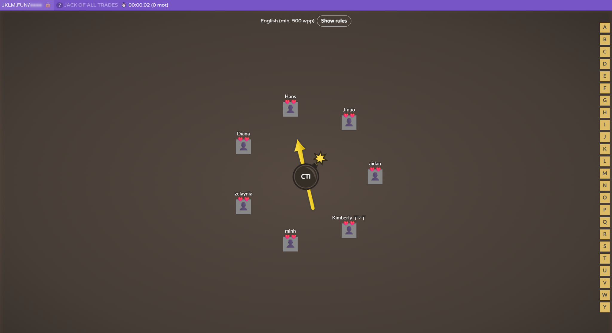
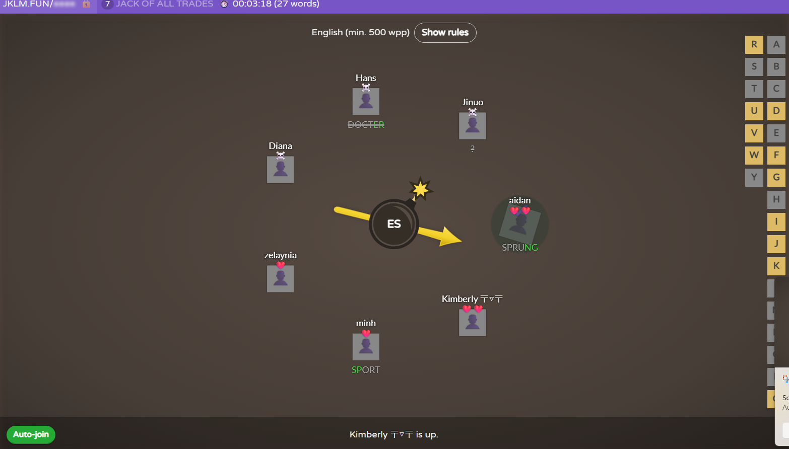
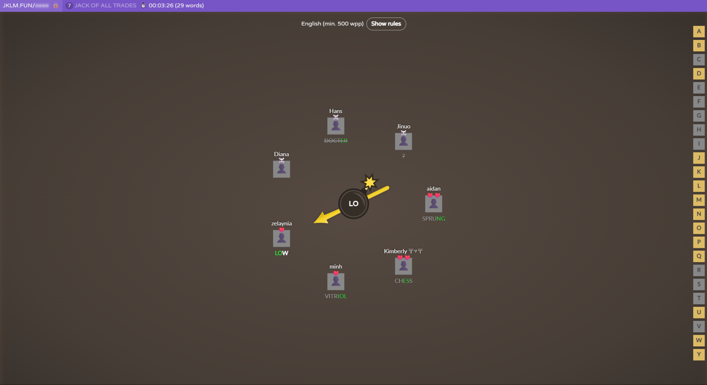

# Jack-Of-All-Trades

> *Note:* This document will evolve throughout your project. You commit regularly to this file while working on the project (especially edits/additions/deletions to the *Highlights* section). **This document will serve as a master plan between your team and your TA.**

## Product Details

#### Q1: What is the product?

Jack-Of-All-Trades is a web application that gives small business owners, entrepreneurs, and independent creators one centralized dashboard for managing their sales, inventory, public product profiles, and basic business analytics.

Running a small business often requires using several different tools to keep track of sales, inventory, revenue, expenses, projects, and customer-facing information. This can be especially difficult for new business owners who may not yet have an organized system for managing their operations. Jack-Of-All-Trades is intended to reduce this complexity by bringing these tasks together into one customizable and user-friendly dashboard.

For the current scope of the project, we are focusing primarily on sales tracking, inventory management, a public-facing business profile, and basic business analytics. A business owner will be able to record and review sales made through different channels, such as an online store, an in-person marketplace, or another sales method. They will also be able to keep track of their inventory, choose which products are displayed publicly, and see how products are being sold over time.

For example, a creator who sells handmade products both online and at weekend markets could use the dashboard to record sales from both sources, monitor how much inventory remains, display available products on a public profile, and compare how products are performing across different sales channels.

The broader product vision includes additional features such as revenue and expense tracking, more advanced analytics, goal tracking, project management, customer ordering, and custom inquiry forms. These features may be added later depending on the team's available time and capacity.

The product will be delivered as a web application with a dashboard interface for business owners. The goal for this term is to produce a functional MVP that supports sales tracking, inventory management, a public business profile, and basic analytics.

#### Q2: Who are your target users?

The primary target users are small business owners, entrepreneurs, and independent creators who sell products through one or more sales channels and need a simple way to organize their sales and inventory. The product is intended to be accessible to people who are relatively new to business management while still being useful to more experienced users.

One representative user could be a university student who runs a small handmade jewelry business. They sell products through an online store and at local markets but currently track inventory and sales using separate spreadsheets or notes. They need one place where they can record sales, see which products are running low, and understand how their business is performing.

Another target user could be an independent artist or creator who sells prints, clothing, or other merchandise through social media, e-commerce, and in-person events. Because their sales come from several different sources, they need a centralized dashboard that makes it easier to keep their inventory and sales records organized.

A third example is a first-time entrepreneur running a small product-based business. They may have limited experience with business-management software and want a system that is straightforward rather than spread across several specialized applications.

Potential customers of these businesses are a secondary user group. For the MVP, they will be able to visit a business's public profile and browse products that the business owner has chosen to display. Features such as placing orders, submitting inquiries, or making custom requests are part of the broader product vision rather than the initial MVP.

#### Q3: Why would your users choose your product? What are they using today to solve their problem/need?

Currently, many small businesses use multiple different applications to manage their business. For example, the website their business is on may be tracking their sales profits, but another app or spreadsheet is used for tracking inventory.

Our product aims to reduce the need for multiple different apps for easier navigation and keeping track. This can save users time by avoiding unnecessary switching between different applications, digging through notes when unsure of where something was written down, and comparing different app options for each task they want to handle.

A user-friendly application is one of our main goals for this project. This accommodates users who are just starting out with their businesses or projects as well as users who are experienced business owners. A user-friendly interface, as well as a dashboard that combines their main usage needs in one product, is why users may choose our product instead of relying on multiple different products.

#### Q4: What are the user stories that make up the Minimum Viable Product (MVP)?

**User Story Artifact:**

Our MVP user stories and their implementation progress are tracked in Jira:

* [Jack-Of-All-Trades Jira Board](https://jack-of-all-trades.atlassian.net/jira/software/projects/KAN/list?jql=project+%3D+KAN+ORDER+BY+cf%5B10019%5D+ASC&atlOrigin=eyJpIjoiYmU5OTIwMGE3MDJmNDZkOTljZTExNTQ0OTIxZmJlNmYiLCJwIjoiaiJ9)

* US1: Sales Tracking
  * As a small business owner, I want to log individual sales while also indicating the specific channel (e.g. e-commerce, in-person market, etc.) in order to keep track of my revenue sources.
  * Acceptance Criteria:
    * Given the user is viewing their "Log Sale" page
    * When they input the sale amount, date, and sales channel
    * Then the sale is recorded to the database and the overall revenue total on the dashboard is updated

* US2: Inventory Management
  * As a small business owner, I want to add and update my product inventory in order to know exactly how much stock I currently have.
  * Acceptance Criteria:
    * Given the user is viewing their inventory management dashboard
    * When they click "Add Product", input the product name, price, and quantity and submit the information, or when they update an existing item's quantity and save
    * Then the item appears in the inventory list with the specified stock amount, or the existing item's stock is adjusted to reflect the change

* US3: Public Profile (Seller)
  * As a small business owner, I want to set up a public profile with my available products so potential customers can view my offerings.
  * Acceptance Criteria:
    * Given the user is viewing their inventory management dashboard
    * When they check the "Visible to Public" box on an item and save the changes
    * Then their public-facing profile is updated to display that selected item

* US4: Public Profile (Customer)
  * As a customer, I want to browse a business's public profile in order to see what items they currently have available.
  * Acceptance Criteria:
    * Given the business owner has set up their public profile with items
    * When a customer views their profile page
    * Then they see a gallery displaying the business's public items, including each item's name, image, and price

* US5: Analytics Dashboard
  * As a small business owner, I want to view basic sales analytics so I can understand how my products and sales channels are performing.
  * Acceptance Criteria:
    * Given the user has logged their sales
    * When they navigate to the Analytics Dashboard
    * Then the dashboard displays monthly sales information
    * AND a breakdown of sales separated by channel
    * AND information showing which products are performing well or poorly

**Potential Stretch Goals:**

* US6: Project Management
  * As a small business owner, I want to create project workspaces where I can set deadlines, goals, and build mood boards in order to organize my creative process and track progress.
  * Acceptance Criteria:
    * Given the user is on the "Projects" dashboard and clicks to create a new project
    * When they enter a project title, deadline date, goal, and upload images for their mood board
    * Then a new project workspace is generated that displays the goal and deadline
    * AND displays the uploaded images in a visual mood board grid

#### Q5: Have you decided on how you will build it? Share what you know now or tell us the options you are considering.

**Technology Stack:**

* Frontend: React, TypeScript
* Styling: Tailwind CSS
* Backend: Java, Spring Boot
* Database: PostgreSQL
* PaaS: Render
* Version Control: GitHub

React and TypeScript will be used for the dashboard and public-facing pages. Spring Boot will provide REST APIs and handle business logic, authentication, validation, and database access. PostgreSQL will store users, products, inventory, and sales data.

**Deployment:**

The application will be deployed as a cloud-hosted web application using Render. The React frontend and Spring Boot backend will be deployed as separate services, with PostgreSQL used as the relational database.

**Architecture:**

We will use a standard three-tier client-server architecture. The backend will use a modular monolith structure, separating features such as authentication, inventory, sales, analytics, and business profiles into different modules while keeping them within one application. This keeps the system organized without the additional complexity of microservices.

```text
+----------------------+
|         User         |
+----------+-----------+
           |
           v
+----------------------+
|  React + TypeScript  |
|       Frontend       |
|     Tailwind CSS     |
+----------+-----------+
           |
           | HTTPS / REST API
           v
+----------------------+
| Spring Boot Backend  |
|   Modular Monolith   |
+----+-----------+-----+
     |           |
     |           |
     v           v
+----------+   +------------------+
|PostgreSQL|   |    Cloudinary    |
| Database |   |  Product Images  |
+----------+   +------------------+
```

The frontend handles the user interface and sends requests to the backend. The backend handles business logic, authentication, validation, and communication with the database. PostgreSQL stores users, products, inventory, sales, and other application data.

**Third-Party Applications and APIs:**

* Cloudinary: We are considering Cloudinary for product image upload, storage, and delivery. This is the third-party service most directly relevant to the MVP because product images are used in inventory listings and public business profiles.
* Google Identity Services: This may be used later as an optional Google Sign-In method.
* Stripe: This may be used in a later version if customers are able to place orders and make payments through public business profiles.
* Resend: This may be used later for transactional emails such as password resets, notifications, or customer inquiry confirmations.

Cloudinary is the external service we are most likely to use for the MVP. Google Identity Services, Stripe, and Resend are optional or future integrations and are not required for the initial MVP.

----

## Intellectual Property Confidentiality Agreement

Not applicable. Jack-Of-All-Trades is a self-proposed project and does not have an external project partner.

----

## Teamwork Details

#### Q6: Have you met with your team?

* We met online through Discord, where we introduced ourselves, shared a few fun facts, and got to know each other better.
* We played an online game called Bomb Party. The fast-paced, competitive nature of the game helped create a comfortable dynamic between us before we started discussing the project work in more depth.
* 
* 
* 
* Diana Akhmedova:
  * Loves to go alpine skiing.
* Kimberly Prijadi:
  * Plays mobile rhythm games.
* Jinuo Tao:
  * Was a philosophy and linguistics major.
* Minh Tran:
  * Gacha addict.
* Allie Huynh:
  * Bottle-fed a tiger.
* Hans Santiago:
  * Was originally planning to go into law.
* Aidan Wang:
  * Likes to play video games and go to the gym.

#### Q7: What are the roles & responsibilities on the team?

Our team is divided primarily into frontend and backend development, with Diana and Kimberly also serving as team leads. Everyone will contribute to implementation, while feature ownership and individual tasks will be assigned through Jira as development progresses.

**Team Leads:**

**Diana: Team Lead / Backend Developer:**

* Responsibilities:
  * Coordinate the overall development of the project.
  * Help divide work and keep frontend and backend development aligned.
  * Contribute to the Spring Boot backend, including business logic, API development, and database-related work.
  * Review implementation decisions and help resolve technical blockers.
* Reason for role:
  * Diana was one of the original members who proposed the project idea, so she has a strong understanding of the intended product direction, core features, and overall vision. She also has experience with Python, Java, C, SQL, Spring Boot, Flask, and MongoDB.

**Kimberly: Team Lead / Frontend Developer:**

* Responsibilities:
  * Coordinate the overall development of the project.
  * Work on wireframes and the structure of the user interface.
  * Implement frontend components and connect the React frontend to backend APIs.
  * Help maintain consistency in the UI/UX of the application.
* Reason for role:
  * Kimberly was also one of the original members who proposed the project idea, so she has a strong understanding of how the team wants the product to look and function. She has experience with frontend development using React, Vue, and TypeScript, as well as UI/UX design.

**Frontend:**

**Allie: Frontend Developer:**

* Responsibilities:
  * Implement React and TypeScript user-interface components.
  * Build pages and forms for the application's main features.
  * Connect frontend components to backend functionality.
  * Participate in frontend testing and improve the usability of the interface.
* Reason for role:
  * Allie has experience with Python, Java, JavaScript, and C. She is open to learning frontend development and is interested in design.

**Minh: Frontend Developer:**

* Responsibilities:
  * Implement React and TypeScript components.
  * Build and maintain the dashboard interface.
  * Integrate backend API responses into the user interface.
  * Participate in frontend testing and code review.
* Reason for role:
  * Minh has experience with React and TypeScript, which directly matches the technologies we plan to use for the frontend.

**Backend:**

**Hans: Backend Developer:**

* Responsibilities:
  * Implement backend endpoints and application logic in Spring Boot.
  * Work with the database and application data models.
  * Integrate backend functionality with the frontend.
  * Participate in backend testing and code review.
* Reason for role:
  * Hans has experience with Python, Java, C, SQL, and shell scripting. His Java and SQL experience is relevant to our Spring Boot and PostgreSQL backend.

**Aidan: Backend Developer:**

* Responsibilities:
  * Implement Spring Boot APIs and backend business logic.
  * Work with PostgreSQL and the application's data layer.
  * Test backend functionality and API behavior.
  * Participate in code review and frontend-backend integration.
* Reason for role:
  * Aidan has experience with Python, Java, C, and SQL. His Java and SQL experience aligns with the technologies selected for the backend.

**Jinuo: Backend Developer:**

* Responsibilities:
  * Implement REST API endpoints and backend business logic in Spring Boot.
  * Work with PostgreSQL and database integration.
  * Help define communication between the frontend and backend.
  * Participate in backend testing, integration, and code review.
* Reason for role:
  * Jinuo has experience with Python, Java, C, TypeScript/JavaScript, and PostgreSQL. His Java and PostgreSQL experience fits the backend stack, while his JavaScript and TypeScript experience can also help with frontend-backend integration.

Although these roles describe our initial division of responsibilities, they are not strict boundaries. Everyone is expected to contribute code, participate in reviews, and help with testing and documentation. Specific feature assignments will be tracked through Jira and adjusted according to workload, experience, and project needs.

#### Q8: How will you work as a team?

Our team will primarily work asynchronously, with recurring online meetings used to coordinate development and resolve issues.

* Weekly Sync Meetings:
  * Held online through Discord or Zoom.
  * Most meetings will be used to go over upcoming deliverables, discuss responsibilities, updates, roadblocks, and the direction of the project.
  * Meetings are held every Monday at 8:30 PM.
* Ad Hoc Meetings:
  * Additional short meetings may be scheduled when a feature requires closer coordination or when a blocker cannot be resolved asynchronously.
* Asynchronous Work:
  * The majority of coding will be done individually/asynchronously.
  * Team members will communicate through Discord and track tasks and progress through Jira.
  * Code reviews and integration work will be coordinated as needed.

#### Q9: How will you organize your team?

* Task Tracking:
  * Jira will be used to keep track of what needs to get done, task assignments, and progress.
  * [Jack-Of-All-Trades Jira Project](https://jack-of-all-trades.atlassian.net/?continue=https%3A%2F%2Fjack-of-all-trades.atlassian.net%2Fwelcome%2Fsoftware%3FprojectId%3D10001&atlOrigin=eyJpIjoiNmJhODU0NDlhOWFmNDRiNjk1OWZhMDZhOWVmNjJhNjAiLCJwIjoiamlyYS1zb2Z0d2FyZSJ9)
* Meeting Organization:
  * Meetings may be recorded and processed through AI to help produce minutes.
  * Meeting minutes will be stored in the repository under deliverables/minutes.
  * Agendas can be made before meetings, and summaries or minutes can be made after meetings.
* Task Prioritization:
  * We will focus on main features first. Parts or features that are vital to continuing work on the project, or that other features depend on, will take priority.
* Task Assignment:
  * Tasks will be assigned based on skill set and experience, while also considering interest, availability, and workload. Assignment will be mostly voluntary when possible.
* Progress Tracking:
  * Work status will be tracked in Jira and shared team documents.

#### Q10: What are the rules regarding how your team works?

**Communications:**

* Communication will be mostly through Discord. Meetings will be held on Discord or Zoom weekly.
* Team members are expected to communicate blockers or delays as early as possible so responsibilities can be adjusted if needed.

**Collaboration:**

* We will keep track of who is attending meetings and contributing to the project through Jira and shared team documents.
* If one person does not contribute or is not responsive, we will try to contact them in the group chat first.
* If the person remains unresponsive, we will escalate the issue to the TA and have another member take over the task if necessary.
* Work may be redistributed later to keep contributions reasonably balanced across the team.

## Organisation Details

#### Q11. How does your team fit within the overall team organisation of the partner?

Not applicable. This is a self-proposed project with no external project partner.

#### Q12. How does your project fit within the overall product from the partner?

Not applicable. This is a self-proposed project with no external project partner.

## Potential Risks

#### Q13. What are some potential risks to your project?

* Project Scope:
  * There may be differences between the broader vision or idea and the number of features we can realistically implement. We need to pick a realistic and reasonable number of features based on the timeline we have so that the core MVP can still be completed.
* Security:
  * Storing customer and business information securely may be a risk, especially if the application handles personal information. Poor input validation, authentication, or database handling could expose user information or create vulnerabilities.
* Communication:
  * Team members might have different visions for the same feature, leading to inconsistent implementations. If expectations are not clarified early, this could also create additional rework during integration.
* Work Distribution:
  * Some team members might get less or more work than they have time to do. Differences in workload and availability could delay tasks or make development less balanced.

#### Q14. What are some potential mitigation strategies for the risks you identified?

* Project Scope:
  * We will have conversations about the features to implement and compromise on the number of features if necessary. Core MVP features will be prioritized first, while lower-priority features can be treated as stretch goals.
* Security:
  * We will block SQL injection through parameterized database queries, enforce server-side data validation, and use appropriate authentication and authorization checks.
* Communication:
  * Before working on each feature, we will clarify its functionality and the communication pipeline between the backend and frontend. API expectations will be discussed early to reduce inconsistent implementations.
* Work Distribution:
  * We will consult the TA and team members on expectations for features, check team member availability and workload, and distribute work appropriately. Tasks may be reassigned if someone becomes overloaded or unavailable.
