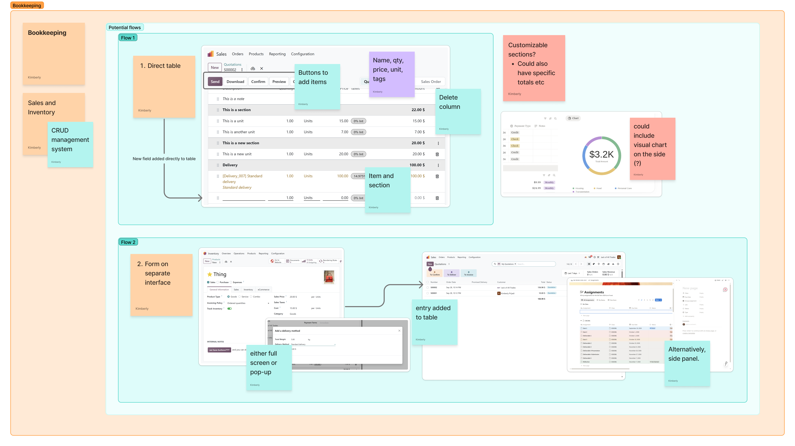
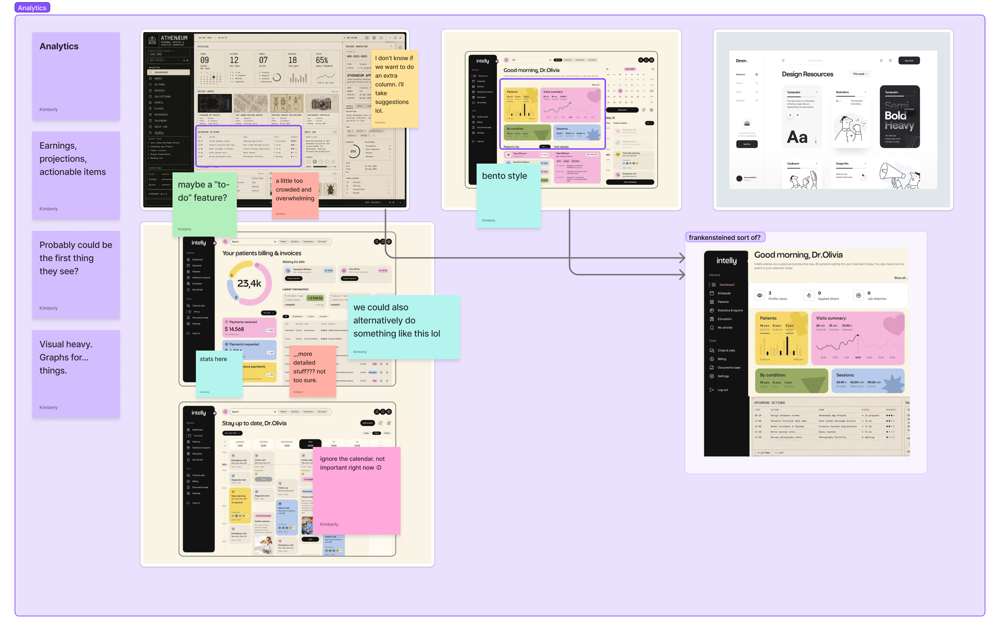
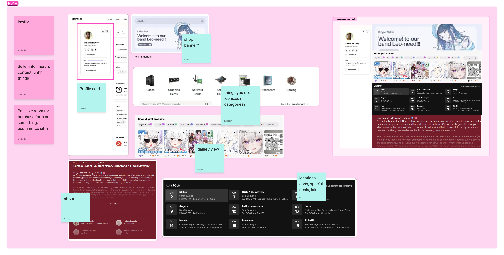
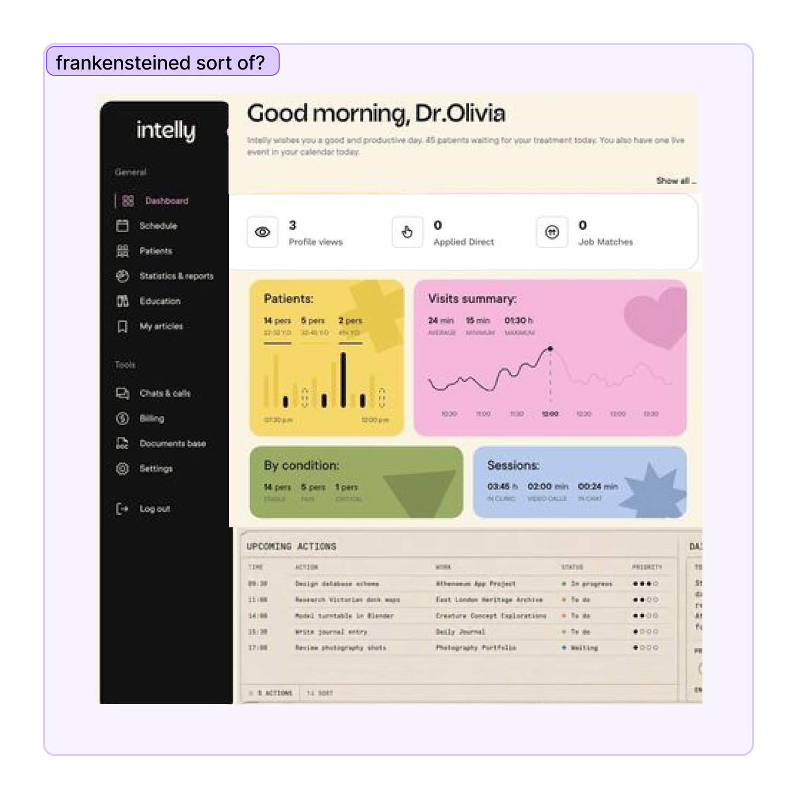
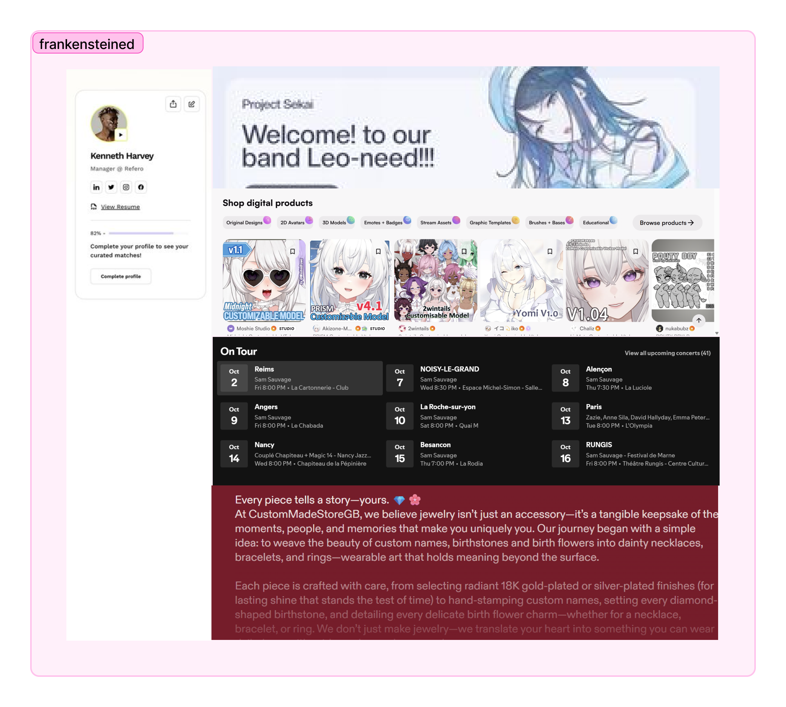

# Prototyping

> All prototyping and moodboarding is done on Figma. [Here is the Figma team invite link.](https://www.figma.com/team_invite/redeem/qfnCT12Yeh26eDxnB0LLDp?t=oKxvF9rcLjjKkrKY-21)

### Moodboarding and "Sketching"
[Temporary FigJam Link](https://www.figma.com/board/Q8uqe6knzgQt4cmKoTJ5LW/Moodboarding--?node-id=0-1&t=sqTopg36Xg1o18UK-1)

- Collected ideas from various websites and Pinterest, looking for elements that could be implemented into the core design.
- Considered different user flows, especially for bookkeeping. 

|Bookkeeping|Analytics|Profile|
|---|---|---|
||||

### Interactive Prototypes - Bookkeeping
Considering that we want to implement the bookkeeping system first, we focused on prototyping that flow first.
- [Figma link](https://www.figma.com/design/599kTQqSWQgfSkQ4YKGJiw/Wireframe?node-id=19-8332&t=Uj35QF0x9h8AP8qG-1)
- [Preview link](https://www.figma.com/proto/599kTQqSWQgfSkQ4YKGJiw/Wireframe?node-id=3-2&viewport=37%2C146%2C0.11&t=eD2uM0blsRdbeQEh-1&scaling=contain&content-scaling=fixed&starting-point-node-id=3%3A2&page-id=0%3A1)

### Collaging - Analytics and Profile
These are secondary functionalities that we have yet to prototype, but we did consider some form of layout based on elements we like. These are still subject to change.

|Analytics|Profile|
|---|---|
|||

## Next Steps (Front-end)
1. Refine existing prototype, potentially making changes to the style of things.
2. Divide the pages into specific components and assign tasks between the front-end team.
3. ...
